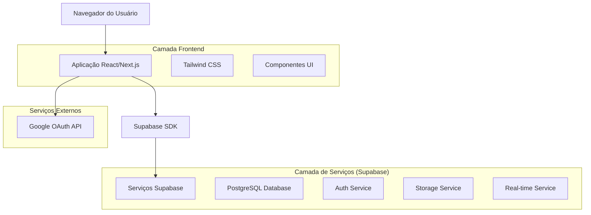
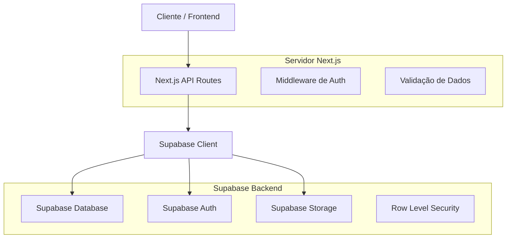
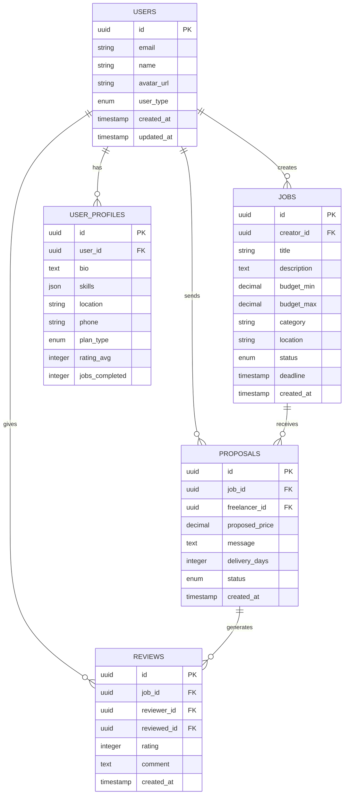

# Documento de Arquitetura Técnica - PulseConnect

## 1. Arquitetura de Design



## 2. Descrição das Tecnologias

* Frontend: Next.js\@14 + React\@18 + TypeScript + Tailwind CSS\@3

* Backend: Supabase (PostgreSQL + Auth + Storage + Real-time)

* Autenticação: Google OAuth via Supabase Auth

* Deploy: Vercel (Frontend) + Supabase (Backend)

* Estilização: Tailwind CSS com configuração customizada para modo escuro

## 3. Definições de Rotas

| Rota               | Propósito                                          |
| ------------------ | -------------------------------------------------- |
| /                  | Página inicial com jobs em destaque e busca rápida |
| /jobs              | Listagem completa de jobs com filtros avançados    |
| /jobs/\[id]        | Detalhes específicos de um job                     |
| /freelancers       | Listagem de freelancers disponíveis                |
| /freelancers/\[id] | Perfil detalhado do freelancer                     |
| /proposals         | Gerenciamento de propostas enviadas/recebidas      |
| /profile           | Perfil do usuário logado                           |
| /reviews           | Sistema de avaliações e histórico                  |
| /admin             | Dashboard administrativo (acesso restrito)         |
| /auth/login        | Página de login com Google OAuth                   |
| /auth/callback     | Callback do Google OAuth                           |

## 4. Definições de API

### 4.1 APIs Principais

**Autenticação de usuários**

```
POST /auth/v1/token
```

Request:

| Nome do Parâmetro | Tipo   | Obrigatório | Descrição                 |
| ----------------- | ------ | ----------- | ------------------------- |
| provider          | string | true        | Provedor OAuth (google)   |
| access\_token     | string | true        | Token de acesso do Google |

Response:

| Nome do Parâmetro | Tipo   | Descrição                    |
| ----------------- | ------ | ---------------------------- |
| access\_token     | string | Token de acesso da sessão    |
| user              | object | Dados do usuário autenticado |

**Gerenciamento de Jobs**

```
GET /rest/v1/jobs
POST /rest/v1/jobs
PUT /rest/v1/jobs/{id}
DELETE /rest/v1/jobs/{id}
```

**Gerenciamento de Propostas**

```
GET /rest/v1/proposals
POST /rest/v1/proposals
PUT /rest/v1/proposals/{id}
```

**Sistema de Avaliações**

```
GET /rest/v1/reviews
POST /rest/v1/reviews
```

## 5. Arquitetura do Servidor



## 6. Modelo de Dados

### 6.1 Definição do Modelo de Dados



### 6.2 Linguagem de Definição de Dados

**Tabela de Usuários (users)**

```sql
-- Usar tabela auth.users do Supabase como base
-- Criar tabela de perfis complementar
CREATE TABLE user_profiles (
    id UUID PRIMARY KEY DEFAULT gen_random_uuid(),
    user_id UUID REFERENCES auth.users(id) ON DELETE CASCADE,
    bio TEXT,
    skills JSONB DEFAULT '[]',
    location VARCHAR(255),
    phone VARCHAR(20),
    plan_type VARCHAR(20) DEFAULT 'free' CHECK (plan_type IN ('free', 'premium')),
    rating_avg DECIMAL(3,2) DEFAULT 0,
    jobs_completed INTEGER DEFAULT 0,
    user_type VARCHAR(20) DEFAULT 'freelancer' CHECK (user_type IN ('freelancer', 'client', 'admin')),
    created_at TIMESTAMP WITH TIME ZONE DEFAULT NOW(),
    updated_at TIMESTAMP WITH TIME ZONE DEFAULT NOW()
);

-- Índices
CREATE INDEX idx_user_profiles_user_id ON user_profiles(user_id);
CREATE INDEX idx_user_profiles_user_type ON user_profiles(user_type);
CREATE INDEX idx_user_profiles_rating ON user_profiles(rating_avg DESC);
```

**Tabela de Jobs (jobs)**

```sql
CREATE TABLE jobs (
    id UUID PRIMARY KEY DEFAULT gen_random_uuid(),
    creator_id UUID REFERENCES auth.users(id) ON DELETE CASCADE,
    title VARCHAR(255) NOT NULL,
    description TEXT NOT NULL,
    budget_min DECIMAL(10,2),
    budget_max DECIMAL(10,2),
    category VARCHAR(100) NOT NULL,
    location VARCHAR(255),
    status VARCHAR(20) DEFAULT 'open' CHECK (status IN ('open', 'in_progress', 'completed', 'cancelled')),
    deadline TIMESTAMP WITH TIME ZONE,
    created_at TIMESTAMP WITH TIME ZONE DEFAULT NOW(),
    updated_at TIMESTAMP WITH TIME ZONE DEFAULT NOW()
);

-- Índices
CREATE INDEX idx_jobs_creator_id ON jobs(creator_id);
CREATE INDEX idx_jobs_category ON jobs(category);
CREATE INDEX idx_jobs_status ON jobs(status);
CREATE INDEX idx_jobs_created_at ON jobs(created_at DESC);
```

**Tabela de Propostas (proposals)**

```sql
CREATE TABLE proposals (
    id UUID PRIMARY KEY DEFAULT gen_random_uuid(),
    job_id UUID REFERENCES jobs(id) ON DELETE CASCADE,
    freelancer_id UUID REFERENCES auth.users(id) ON DELETE CASCADE,
    proposed_price DECIMAL(10,2) NOT NULL,
    message TEXT,
    delivery_days INTEGER NOT NULL,
    status VARCHAR(20) DEFAULT 'pending' CHECK (status IN ('pending', 'accepted', 'rejected', 'withdrawn')),
    created_at TIMESTAMP WITH TIME ZONE DEFAULT NOW(),
    updated_at TIMESTAMP WITH TIME ZONE DEFAULT NOW()
);

-- Índices
CREATE INDEX idx_proposals_job_id ON proposals(job_id);
CREATE INDEX idx_proposals_freelancer_id ON proposals(freelancer_id);
CREATE INDEX idx_proposals_status ON proposals(status);
```

**Tabela de Avaliações (reviews)**

```sql
CREATE TABLE reviews (
    id UUID PRIMARY KEY DEFAULT gen_random_uuid(),
    job_id UUID REFERENCES jobs(id) ON DELETE CASCADE,
    reviewer_id UUID REFERENCES auth.users(id) ON DELETE CASCADE,
    reviewed_id UUID REFERENCES auth.users(id) ON DELETE CASCADE,
    rating INTEGER NOT NULL CHECK (rating >= 1 AND rating <= 5),
    comment TEXT,
    created_at TIMESTAMP WITH TIME ZONE DEFAULT NOW()
);

-- Índices
CREATE INDEX idx_reviews_job_id ON reviews(job_id);
CREATE INDEX idx_reviews_reviewed_id ON reviews(reviewed_id);
CREATE INDEX idx_reviews_rating ON reviews(rating DESC);
```

**Políticas de Segurança (RLS)**

```sql
-- Habilitar RLS em todas as tabelas
ALTER TABLE user_profiles ENABLE ROW LEVEL SECURITY;
ALTER TABLE jobs ENABLE ROW LEVEL SECURITY;
ALTER TABLE proposals ENABLE ROW LEVEL SECURITY;
ALTER TABLE reviews ENABLE ROW LEVEL SECURITY;

-- Políticas para user_profiles
CREATE POLICY "Perfis públicos são visíveis para todos" ON user_profiles
    FOR SELECT USING (true);

CREATE POLICY "Usuários podem atualizar próprio perfil" ON user_profiles
    FOR UPDATE USING (auth.uid() = user_id);

-- Políticas para jobs
CREATE POLICY "Jobs são visíveis para todos" ON jobs
    FOR SELECT USING (true);

CREATE POLICY "Usuários podem criar jobs" ON jobs
    FOR INSERT WITH CHECK (auth.uid() = creator_id);

CREATE POLICY "Criadores podem atualizar próprios jobs" ON jobs
    FOR UPDATE USING (auth.uid() = creator_id);

-- Políticas para proposals
CREATE POLICY "Propostas visíveis para criador do job e freelancer" ON proposals
    FOR SELECT USING (
        auth.uid() = freelancer_id OR 
        auth.uid() IN (SELECT creator_id FROM jobs WHERE id = job_id)
    );

CREATE POLICY "Freelancers podem criar propostas" ON proposals
    FOR INSERT WITH CHECK (auth.uid() = freelancer_id);

-- Políticas para reviews
CREATE POLICY "Avaliações são visíveis para todos" ON reviews
    FOR SELECT USING (true);

CREATE POLICY "Usuários podem criar avaliações" ON reviews
    FOR INSERT WITH CHECK (auth.uid() = reviewer_id);
```

**Dados Iniciais**

```sql
-- Inserir categorias padrão
INSERT INTO jobs (creator_id, title, description, budget_min, budget_max, category, location)
VALUES 
    ('00000000-0000-0000-0000-000000000000', 'Desenvolvimento de Website', 'Criação de site institucional responsivo', 1500.00, 3000.00, 'Desenvolvimento Web', 'São Paulo, SP'),
    ('00000000-0000-0000-0000-000000000000', 'Design de Logo', 'Criação de identidade visual para startup', 500.00, 1200.00, 'Design Gráfico', 'Rio de Janeiro, RJ');
```

