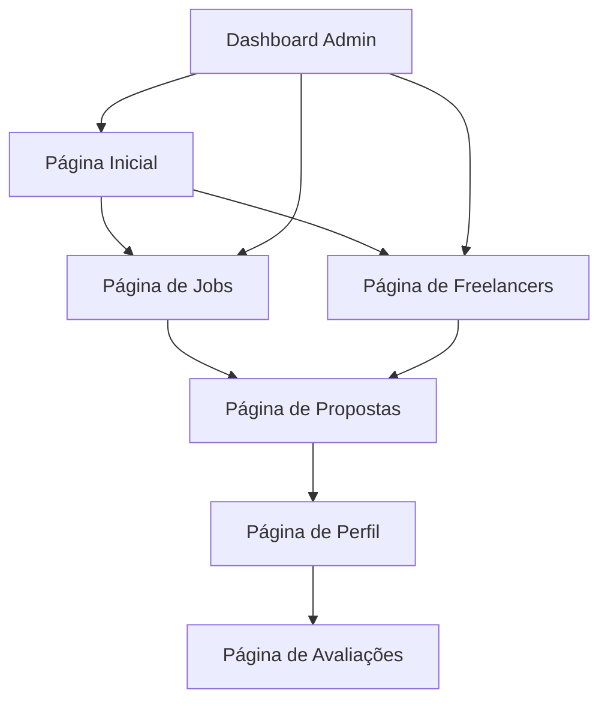

# Documento de Requisitos do Produto - PulseConnect

## 1. Visão Geral do Produto

O PulseConnect é um marketplace mobile-first que conecta freelancers e contratantes para vagas temporárias e prestação de serviços. A plataforma permite publicação de jobs, sistema de propostas internas, avaliações e fechamento de contratos sem troca de contatos externos.

O produto resolve o problema da dificuldade de conexão entre prestadores de serviços e contratantes, oferecendo um ambiente seguro e controlado para negociações. O foco é proporcionar uma experiência otimizada para dispositivos móveis, garantindo usabilidade e performance em smartphones.

O objetivo é criar um marketplace confiável que facilite conexões profissionais, aumentando a eficiência do mercado de trabalho freelancer no Brasil.

## 2. Funcionalidades Principais

### 2.1 Perfis de Usuário

| Perfil | Método de Cadastro | Permissões Principais |
|--------|-------------------|----------------------|
| Freelancer/Prestador | Cadastro via Google OAuth | Candidatar-se a jobs, publicar serviços, receber avaliações |
| Contratante | Cadastro via Google OAuth | Publicar jobs, contratar freelancers, avaliar prestadores |
| Admin | Acesso administrativo | Gerenciar usuários, jobs, planos e métricas da plataforma |

### 2.2 Módulos de Funcionalidades

Nossos requisitos do PulseConnect consistem nas seguintes páginas principais:

1. **Página Inicial**: navegação principal, listagem de jobs em destaque, busca rápida
2. **Página de Jobs**: listagem completa de jobs, filtros de busca, detalhes das vagas
3. **Página de Freelancers**: listagem de prestadores, perfis detalhados, rankings
4. **Página de Propostas**: envio e gerenciamento de propostas, aceite de contratos
5. **Página de Perfil**: dados do usuário, histórico, avaliações recebidas
6. **Página de Avaliações**: sistema de avaliação pós-job, ranking em estrelas
7. **Dashboard Admin**: gestão de usuários, jobs, métricas e planos pagos

### 2.3 Detalhes das Páginas

| Nome da Página | Nome do Módulo | Descrição da Funcionalidade |
|----------------|----------------|-----------------------------|
| Página Inicial | Navegação Principal | Exibir menu de navegação responsivo, acesso rápido às principais seções, toggle modo claro/escuro |
| Página Inicial | Jobs em Destaque | Mostrar jobs mais relevantes e recentes com filtro por categoria |
| Página Inicial | Busca Rápida | Permitir busca por palavras-chave, localização e tipo de serviço |
| Página de Jobs | Listagem de Jobs | Exibir todos os jobs disponíveis com paginação e ordenação |
| Página de Jobs | Filtros Avançados | Filtrar por categoria, valor, prazo, localização e tipo de contratante |
| Página de Jobs | Detalhes do Job | Mostrar descrição completa, requisitos, prazo e valor oferecido |
| Página de Freelancers | Lista de Prestadores | Exibir freelancers disponíveis com foto, especialidade e ranking |
| Página de Freelancers | Perfil Detalhado | Mostrar portfólio, avaliações, jobs concluídos e especialidades |
| Página de Freelancers | Sistema de Ranking | Calcular e exibir ranking baseado em avaliações e jobs concluídos |
| Página de Propostas | Envio de Propostas | Permitir freelancers enviarem propostas com valor e prazo |
| Página de Propostas | Gerenciamento | Visualizar propostas enviadas/recebidas, status e histórico |
| Página de Propostas | Aceite de Contratos | Permitir contratantes aceitarem propostas e fecharem contratos |
| Página de Perfil | Dados Pessoais | Gerenciar informações do usuário, foto e dados de contato |
| Página de Perfil | Histórico de Jobs | Exibir jobs concluídos, em andamento e cancelados |
| Página de Perfil | Plano Premium | Permitir upgrade para plano pago com recursos de destaque |
| Página de Avaliações | Sistema de Estrelas | Implementar avaliação de 1 a 5 estrelas estilo Uber |
| Página de Avaliações | Comentários | Permitir comentários detalhados sobre a experiência |
| Página de Avaliações | Histórico de Avaliações | Exibir todas as avaliações recebidas e dadas |
| Dashboard Admin | Gestão de Usuários | Visualizar, aprovar, suspender e remover usuários |
| Dashboard Admin | Gestão de Jobs | Moderar, aprovar e remover jobs publicados |
| Dashboard Admin | Métricas da Plataforma | Exibir estatísticas de uso, jobs concluídos e receita |

## 3. Processo Principal

**Fluxo do Freelancer:**
O freelancer acessa a plataforma via Google OAuth, navega pelos jobs disponíveis, visualiza detalhes das vagas e envia propostas com valor e prazo. Após aceite do contratante, executa o serviço e recebe avaliação.

**Fluxo do Contratante:**
O contratante faz login via Google OAuth, publica um job com descrição e valor, recebe propostas dos freelancers, analisa perfis e rankings, aceita uma proposta e avalia o prestador após conclusão.

**Fluxo do Admin:**
O administrador acessa o dashboard, monitora atividades da plataforma, modera conteúdo inadequado, gerencia usuários e acompanha métricas de performance.

## 4. Design da Interface do Usuário

### 4.1 Estilo de Design

**Padrão Visual Bancário:**
- Cores primárias: Azul escuro (#1e3a8a), Azul médio (#3b82f6)
- Cores secundárias: Cinza neutro (#6b7280), Verde sucesso (#10b981)
- Estilo de botões: Bordas arredondadas (8px), sombras sutis, estados hover/active
- Fontes: Inter (títulos), Open Sans (corpo do texto), tamanhos 14px-24px
- Layout: Design baseado em cards, navegação superior fixa, sidebar responsiva
- Ícones: Lucide React com estilo minimalista, tamanho 20px-24px

### 4.2 Visão Geral do Design das Páginas

| Nome da Página | Nome do Módulo | Elementos da UI |
|----------------|----------------|----------------|
| Página Inicial | Navegação Principal | Header fixo azul escuro, logo centralizada, menu hambúrguer mobile, toggle dark mode |
| Página Inicial | Jobs em Destaque | Cards brancos com sombra sutil, imagens de categoria, badges de status |
| Página Inicial | Busca Rápida | Input com ícone de lupa, filtros dropdown, botão CTA azul |
| Página de Jobs | Listagem de Jobs | Grid responsivo, cards com hover effect, paginação numerada |
| Página de Jobs | Filtros Avançados | Sidebar colapsível, checkboxes customizados, sliders de preço |
| Página de Freelancers | Lista de Prestadores | Cards com foto circular, badges de especialidade, estrelas de rating |
| Página de Propostas | Envio de Propostas | Modal overlay, formulário estruturado, botões de ação destacados |
| Página de Perfil | Dados Pessoais | Layout em duas colunas, campos editáveis inline, upload de imagem |
| Página de Avaliações | Sistema de Estrelas | Componente de estrelas interativo, textarea para comentários |
| Dashboard Admin | Métricas da Plataforma | Gráficos com Chart.js, cards de estatísticas, tabelas responsivas |

### 4.3 Responsividade

A plataforma é mobile-first com breakpoints otimizados:
- Mobile: 320px-768px (design principal)
- Tablet: 768px-1024px (adaptação de layout)
- Desktop: 1024px+ (expansão de conteúdo)

Incluindo otimizações para touch, gestos de swipe e navegação por toque em dispositivos móveis.